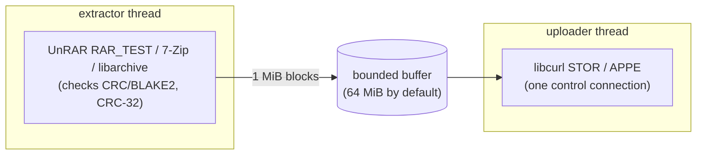

# StreamExtract

Uploads the contents of a RAR, ZIP, 7z or tar archive, or an exFAT volume
image, straight to an FTP
server, **without extracting it to disk first**.

The usual way to publish a huge archive is to extract it (needing as much free
space as the unpacked data, with the CPU busy and the network idle) and then
upload it (network busy, CPU idle). `StreamExtract` streams each file from the
decompressor to the FTP data connection instead:

- **No temporary files**: nothing is written to the local disk.
- **Automatic upload retries**: up to 3 attempts for the initial connection/login
  and each file upload, resuming the bytes already on the server, with no delay
  between attempts.
- **Decompression and upload overlap**: a bounded memory buffer (64 MiB by
  default) sits between the two, so the CPU and the network work at the same
  time.
- **No local name collisions**: since nothing is extracted locally, archives
  with names that differ only in letter case (`README.txt` / `Readme.txt`)
  upload correctly from case-insensitive systems (macOS, Windows) to
  case-sensitive servers.

It comes in two forms, with the same engine:

- [**StreamExtract**](#desktop-app-streamextract), a desktop app for Windows, macOS
  and Linux.
- [**sext**](#command-line-sext), a command-line tool with a full-screen
  terminal interface.

Both are published as assets of each release on the repository's
[**Releases** page](https://github.com/RuiNelson/streamextract/releases), one `.rar`
per platform. Extracting them needs a program that reads RAR5 (WinRAR, 7-Zip,
Keka, `unrar`, ...).

## Desktop app (StreamExtract)

<table>
<tr>
<td></td>
<td></td>
</tr>
</table>

The app offers:

- **Archives**: drop RAR, ZIP, 7z or tar archives (also compressed: `.tar.gz`,
  `.tgz`, `.tar.xz`...), or an exFAT volume image (`.exfat`), on the window,
  or select several with **Add File**. **Remove File** removes an archive from
  the queue before uploading. Archives run in order with the same server,
  directory and other settings; a failed archive does not stop the remaining ones.
  For multi-volume sets, use the first volume
  (`.part1.rar`, `.zip.001`, `.7z.001`...).
  When the archive is encrypted and no password was typed in, the app asks for
  it, and asks again if it was wrong. **Show passwords** toggles visibility for all
  password fields, including that prompt, and is saved automatically in
  `~/.config/streamextract/preferences.ini` (off by default).
- **Server**: host, port, passive or active mode, username and password
  (anonymous without a username), destination directory and *Create directory
  if missing*.
  *Advanced* has the buffer size, **Upload attempts** (total for connection/login and
  each file upload, including the first; default: 3; 1 disables retries), the verbose log and **Display units**: SI
  (1000 MB = 1 GB, the default) or binary (1024 MiB = 1 GiB). The choice applies
  to sizes, speeds, log messages and the final summary. The units, buffer size and upload attempts are saved
  automatically in `~/.config/streamextract/preferences.ini`, separately from
  server memory (buffer default: 64 MiB; range: 1–4096 MiB).
  The buffer setting is always entered in MiB. Sizes and speeds are formatted
  by the engine from the original byte counts using the selected units.
- **Memory Save**, **Memory Recall** and **Memory Clear**: keep the server
  settings between runs in `~/.config/streamextract/memory.ini` (under the home
  directory on every OS), a **plain text** file. The first time a login with a
  username is saved, the app asks whether the username and password may be
  stored unencrypted; if not, they are left out (Memory Clear also forgets the
  answer). The archive password is never stored.
- **Progress**: a compact batch progress row with expandable archive statuses,
  the current step, the current file and the whole archive with
  their ETAs (for a compressed tar, by how much of the archive has been read),
  the upload and decompression speeds, the buffer fill, a live log, and a final
  summary with any warnings and results for every archive. **Cancel batch** stops
  the active transfer, prevents remaining archives from starting, and
  removes the incomplete remote file; closing the window during a transfer asks
  for confirmation first.

### Install the app

| Platform | Asset | Contents |
|---|---|---|
| Windows 10/11 (x64) | `streamextract-gui-windows-x64.rar` | `StreamExtract.exe` and `streamextractcore.dll` |
| macOS 12+ (Intel and Apple Silicon) | `streamextract-gui-macos-universal.zip` | `StreamExtract.app` |
| Linux (x64, glibc 2.35+) | `streamextract-gui-linux-x64.rar` | `StreamExtract.AppImage` |
| Linux (arm64, glibc 2.35+) | `streamextract-gui-linux-arm64.rar` | `StreamExtract.AppImage` |

Each archive also holds `LICENSE`, `README.md` and `THIRD_PARTY_NOTICES.md`.
The builds are portable: there is no installer.

- **Windows**: extract the archive into a folder of its own and run
  `StreamExtract.exe`; keep `streamextractcore.dll` next to it. It uses the WebView2
  runtime that Windows 10 and 11 ship. The executable is not code-signed, so
  SmartScreen may warn the first time (*More info* → *Run anyway*).
- **macOS**: extract the archive and move `StreamExtract.app` to `/Applications`.
  Release builds are signed with a Developer ID and notarized by Apple, so they
  open normally.
- **Linux**: extract the archive and run the AppImage (it needs FUSE 2, e.g.
  the `libfuse2` package):

  ```bash
  chmod +x StreamExtract.AppImage
  ./StreamExtract.AppImage
  ```

## Command line (sext)

```bash
sext --file archive.rar \
     --host ftp.example.com --port 21 --mode passive \
     --user username --password "password" \
     --directory "/destination/dir" --mkdir
```

The input can be a RAR, ZIP, 7z or tar archive (also compressed, such as
`backup.tar.zst`), or a single exFAT volume image (`.exfat`); it is recognized
by its content. Multi-volume and
password-protected archives are supported:

```bash
--archive-password "*[open sesame]*"
```

| Option | Description |
|---|---|
| `--file PATH` | RAR, ZIP, 7z or tar archive (plain or compressed), or a single exFAT volume image (`.exfat`), recognized by its content. For multi-volume sets, the first volume (`.part1.rar`, `.rar`, `.zip.001`, `.7z.001`, `.tar.001`). |
| `--host HOST` | FTP server name or address (IPv4 or IPv6). |
| `--port PORT` | Default `21`. |
| `--mode passive\|active` | Data connection mode. Default `passive`. |
| `--user NAME` | Without it, the login is anonymous. |
| `--password PASSWORD` | Requires `--user`. If omitted, it is asked for (hidden) on the terminal. |
| `--directory DIR` | Destination, absolute or relative to the login directory. Without it the login directory is used and a warning says which one. |
| `--mkdir` | Create the destination if it does not exist, with a single `MKD` (not recursive). Without it, a missing destination is an error. |
| `--archive-password PASSWORD` | For encrypted archives; asked for on the terminal when needed. `--rar-password`, its former name, still works. |
| `--no-tui` | Plain log output instead of the full-screen interface (automatic when not on a terminal). |
| `--verbose` | Log every FTP command and reply (the password is masked). |
| `--buffer MIB` | Memory buffer between decompression and upload. Default `64`. |
| `--retries N` | Total attempts for connection/login and each file upload, including the first. Default `3`; `1` disables retries. |

The interface shows a fixed log panel, the progress of the current file and of
the whole archive with their ETAs (for a compressed tar, by how much of the
archive has been read), the upload and decompression speeds, and how full the
buffer is (full: the network is the bottleneck; empty: the CPU
is). **Cancel** with `q`, `Esc` or `Ctrl-C` (or `SIGINT`/`SIGTERM` in plain
mode).

Exit codes: `0` success, `1` error, `2` invalid command line, `130` cancelled.

### Install the command line

| Platform | Asset |
|---|---|
| Windows (x64) | `streamextract-cli-windows-x64.rar` |
| macOS (Intel and Apple Silicon) | `streamextract-cli-macos-universal.rar` |
| Linux (x64, glibc 2.35+) | `streamextract-cli-linux-x64.rar` |
| Linux (arm64, glibc 2.35+) | `streamextract-cli-linux-arm64.rar` |

Each archive holds the `sext` executable, `LICENSE`, `README.md` and
`THIRD_PARTY_NOTICES.md`. The executables are statically linked and need no
other installation.

#### Windows

1. Extract `streamextract-cli-windows-x64.rar` into `C:\StreamExtract`, so that the
   result is `C:\StreamExtract\sext.exe`.

2. Run it from a terminal:

   ```powershell
   C:\StreamExtract\sext.exe --version
   ```

The binary is not code-signed, so if it does not start at all, check whether
your antivirus quarantined it.

#### macOS

Release builds are signed with a Developer ID and notarized by Apple. Extract
the archive into a directory of its own and install it:

```bash
sudo install -d /usr/local/bin
sudo install -m 755 sext /usr/local/bin/sext
sext --version
```

#### Linux

```bash
unrar x streamextract-cli-linux-x64.rar sext/        # or: 7z x -osext streamextract-cli-linux-x64.rar
sudo install -m 755 sext/sext /usr/local/bin/sext
sext --version
```

Without root, install it into a directory in your `PATH` instead, for example
`install -D -m 755 sext/sext ~/.local/bin/sext`. The binary is built on
Ubuntu 22.04, so it runs on distributions with glibc 2.35 or newer; libstdc++
is linked statically.

## How it works



RAR archives are read with UnRAR's test mode, 7z archives with 7-Zip's own
code (its LZMA SDK), ZIP and tar archives with libarchive, and exFAT volume
images with [FatFs](https://elm-chan.org/fsw/ff/). Contents are read in memory,
without creating local files, and go into the buffer, which the FTP upload drains.
A file only counts as uploaded after its checksum was confirmed (tar and exFAT have none,
see below). On an upload failure, the engine verifies the remaining source data,
checks the remote size, and rereads the entry to resume from that offset. Retries
use the same bounded memory buffer; solid archives and compressed tar may need
to decompress earlier entries again. A source error, cancellation, or exhausted
upload attempts removes the incomplete remote file.

The command line links this engine statically. The app uses it through a
shared library (`libstreamextractcore`, C API in `src/capi/streamextract.h`).

Behaviour, in both:

- **Files already on the server** are checked by name and size. A larger
  remote file is deleted before uploading the archive member from the beginning.
  An equal-size file is considered uploaded and skipped. A smaller remote file
  is considered incomplete: its existing bytes are kept and only the remaining
  bytes are appended. Existing contents are trusted without comparison. Missing
  files are uploaded from the beginning; if the server cannot report a file's
  size, it is overwritten from the beginning. Progress and upload totals count
  only the bytes sent in this run.
- **Directories** of the archive, including empty ones, are created.
- **Modification times** are preserved with `MFMT` (or vsftpd's `MDTM` form)
  when the server allows it.
- **RAR**: multi-volume, solid and encrypted (`-p`, `-hp`) archives, in every
  format UnRAR reads (RAR 5.x and older).
- **ZIP**: Stored, Deflate, BZip2, LZMA, XZ, Zstandard and PPMd entries, Zip64
  (files and archives over 4 GiB), traditional (ZipCrypto) and AES encryption, and
  archives split into numbered parts (`.zip.001`, `.zip.002`, ...). A wrong
  password is detected while reading the archive, before anything is sent. Names
  without the UTF-8 flag are read as UTF-8 when they are valid UTF-8 (macOS
  writes them like that), otherwise as code page 437, the format's default.
- **7z**: LZMA, LZMA2, PPMd, BZip2, Deflate and Zstandard with their filters
  (BCJ, BCJ2, ARM64, Delta, ...), solid archives, archives split into numbered
  parts (`.7z.001`, ...) and archives with a password (AES-256), also with
  encrypted file names (`-mhe`). A wrong password is detected while reading the
  archive (by decrypting the names, or the start of the first file), before
  anything is sent. They are read with 7-Zip's own code; BZip2, Deflate and
  Zstandard, which 7-Zip's SDK does not include, are decoded with the libraries
  libarchive uses too (bzip2, zlib and Zstandard).
- **tar**, every variant libarchive reads (POSIX, GNU, pax, old Unix ones),
  plain or compressed with gzip (`.tar.gz`, `.tgz`), bzip2 (`.tar.bz2`), xz
  (`.tar.xz`), lzma (`.tar.lzma`), Zstandard (`.tar.zst`) or LZ4 (`.tar.lz4`),
  also split into numbered parts (`.tar.001`, `.tar.gz.001`, ...). The format
  has **no checksum of the file contents**, only of its headers, so these files
  are uploaded without verification; a warning says so (gzip, xz, Zstandard and
  LZ4 check their own data, but over the whole stream or large blocks, not per
  file). Names without a pax header are read as UTF-8 when valid, otherwise as
  Latin-1.
- **Compressed tar is read once, as it is uploaded.** Its files can only be
  reached by decompressing everything before them, so instead of listing the
  archive first, StreamExtract plans each file when it reaches it and checks the
  server just before sending it, using the same size rules. Complete files and
  existing prefixes of incomplete files are decompressed and dropped; only the
  remaining bytes are sent. There are no totals until the end: the progress
  and the ETA of the whole archive come from how much of the archive file has
  been read.
- **exFAT**: a single raw volume image (`.exfat`), such as one formatted with
  `mkfs.exfat`, or created with `hdiutil` using `-layout NONE -format UDRW`.
  The volume starts at byte zero; disk images with a partition table (even a
  single partition), split images, compressed and encrypted containers are
  rejected. No OS mount or administrator permissions are needed to read it.
  FatFs reads contiguous and fragmented files, Unicode names and file sizes
  over 4 GiB. Directory structure, empty directories and re-run behaviour are
  the same as for archives: contents go directly into the chosen FTP directory.
  Boot and directory metadata checksums are checked, but exFAT has **no checksum
  of the file contents**, so uploads carry the same warning as tar. Uninitialized
  file data is returned as zeroes. FatFs supports one FAT, a contiguous allocation
  bitmap in the first root-directory cluster, at least 256 data clusters, and at
  most 32768 sectors per cluster; volumes outside these limits are rejected.
- The **format** is recognized by the content of the file, not by its extension.
- **Names** of ZIP and tar archives are uploaded as Unicode NFC, the same
  whatever system runs StreamExtract; RAR, 7z and exFAT names are uploaded as the archive
  stores them.
- **Paths are sanitized** like UnRAR does: `..` components, absolute paths and
  control characters never escape the destination directory.
- **Connection and upload failures**: the initial connection/login and each file
  upload get up to 3 attempts (including the first), immediately reconnecting
  or resuming from the size stored on the server. Change this with `--retries N`
  in the CLI or **Upload attempts** under *Advanced* in the GUI. Same-size files
  are considered complete, larger files
  are deleted first, and missing files or files with unknown sizes are uploaded
  from the beginning, following the usual remote-size policy.
- **Fail-fast**: a checksum error, a missing volume, cancellation, or exhausting
  the upload attempts stops the transfer and removes the incomplete remote file.

### Not supported yet

FTPS, extracting only some files, and several parallel connections. Symbolic links, hard links and
file references (`rar -oi`) are skipped with a warning, since FTP cannot
create links.

Also not supported, with an explicit error: 7z archives compressed with
Deflate64 (reported while reading the archive, before anything is sent), ZIP
entries compressed with Deflate64 (which
Windows Explorer uses for large files), old-style spanned ZIP archives (`.z01`,
`.z02`, ..., `.zip`) and single compressed files that are not tar archives
(a plain `.gz`).

## Building

To update the project version everywhere (including the GUI and API examples),
run `scripts/bump_version X.Y.Z` with Python 3. Dependency versions are unchanged.

Requirements: a C++17 compiler, CMake 3.21+, and libcurl (the system one is
used when present; otherwise, or with `-DSTREAMEXTRACT_BUNDLED_CURL=ON`, an FTP-only
libcurl is built from source). UnRAR, the LZMA SDK and FatFs must be downloaded as described below;
the other libraries are fetched by CMake.
libarchive and the compression libraries it uses (zlib, bzip2, liblzma, Zstandard,
LZ4 and, on Linux, mbed TLS) are built from source as static libraries during the
first build (`cmake/LibArchive.cmake`), which therefore takes a few minutes
longer.

The UnRAR sources are not part of this repository (they have their own
license) and must be extracted into `unrarsrc/`:

```bash
curl -LO https://www.rarlab.com/rar/unrarsrc-7.3.1.tar.gz
mkdir unrarsrc && tar -xzf unrarsrc-7.3.1.tar.gz -C unrarsrc --strip-components=1
```

7-Zip's [LZMA SDK](https://www.7-zip.org/sdk.html), which reads the 7z
archives, is not part of the repository either; extract it into `lzmasdk/`, with
bsdtar (the `tar` of macOS) or 7-Zip:

```bash
curl -LO https://github.com/ip7z/7zip/releases/download/26.03/lzma2603.7z
mkdir lzmasdk && tar -xf lzma2603.7z -C lzmasdk    # or: 7z x -olzmasdk lzma2603.7z
```

[FatFs R0.16](https://elm-chan.org/fsw/ff/), the exFAT reader, is also supplied
manually, from its author's website (there is no official GitHub repository):

```bash
curl -LO https://elm-chan.org/fsw/ff/arc/ff16.zip
mkdir fatfs && unzip ff16.zip -d fatfs    # or: 7z x -ofatfs ff16.zip
```

The zip's SHA-256 is
`99f7dc1f7e095356e4a9e3dbe29959090d8b948afe2bbc5441e52fdf4b85449e`.
CMake builds a private copy with a read-only exFAT configuration, UTF-8 names
and the official R0.16 patches 1 and 2. The downloaded sources are unchanged,
and CMake does not download FatFs.

### Command line

```bash
cmake -S . -B build -G Ninja -DCMAKE_BUILD_TYPE=Release
cmake --build build
```

The binary is `build/sext`. UnRAR, the LZMA SDK, FatFs and libarchive are always
linked statically into it.

### Desktop app

Besides the above, install Rust ([rustup](https://rustup.rs)) and the Tauri
CLI:

```bash
cargo install tauri-cli --version "^2" --locked
```

To build manually, run these commands from the repository root:

```bash
cmake -S . -B build -G Ninja -DCMAKE_BUILD_TYPE=Release -DSTREAMEXTRACT_BUILD_LIBRARY=ON
cmake --build build

cd gui
cargo tauri build     # macOS: src-tauri/target/release/bundle/macos/StreamExtract.app
cargo tauri dev       # or: run the app without bundling it
```

The library is `build/libstreamextractcore.dylib` (`.so` on Linux, `streamextractcore.dll` on
Windows). UnRAR, the LZMA SDK, FatFs, libarchive and {fmt} are linked statically into it, and it exports only the
`streamextract_*` functions of `src/capi/streamextract.h`; the `sext` executable does not use
it. Add `-DSTREAMEXTRACT_BUNDLED_CURL=ON` to link libcurl statically too, which makes
the library self-contained instead of relying on the system's libcurl.

On Linux `cargo tauri build` makes an AppImage; on Windows use
`cargo tauri build --no-bundle` and keep `streamextractcore.dll` next to
`src-tauri/target/release/StreamExtract.exe` (the build copies it there). Linux
needs the WebKitGTK development packages that Tauri documents in its
[prerequisites](https://v2.tauri.app/start/prerequisites/#linux); on
Debian/Ubuntu, for example:

```bash
sudo apt install libwebkit2gtk-4.1-dev build-essential curl wget file libxdo-dev libssl-dev \
                 libayatana-appindicator3-dev librsvg2-dev
```

The Rust build looks for the library in `build/` (and `build/Release`); set
`STREAMEXTRACT_LIB_DIR` to the directory that holds it to use another build directory.
The bundling settings (`gui/src-tauri/tauri.<os>.conf.json`) also name the
library under `../../build/`, so with another directory override that path too,
with the Tauri CLI's `--config` (a JSON merge into its configuration, handed to
the build script as well). On macOS:

```bash
STREAMEXTRACT_LIB_DIR=/path/to/dir cargo tauri build \
    --config '{"bundle":{"macOS":{"frameworks":["/path/to/dir/libstreamextractcore.dylib"]}}}'
```

A macOS app built from source is signed ad hoc, not notarized, so Gatekeeper
blocks it once it has been copied to another Mac. Remove the quarantine
attribute there to open it:

```bash
xattr -dr com.apple.quarantine StreamExtract.app
```

### Continuous integration

Developed and tested on macOS. The GitHub Actions workflow
(`.github/workflows/ci.yml`) builds and tests Linux (x64 and arm64), macOS
(universal) and Windows (x64), always with libcurl built from source and linked
statically (Windows does not ship it), and produces one `.rar` per platform,
for the command line and for the app. The macOS release assets are then signed
and notarized before they are published.

## Testing

Unit tests:

```bash
ctest --test-dir build --output-on-failure
```

End-to-end tests upload archives created with RARLAB's `rar`, Python's
`zipfile` and `tarfile`, 7-Zip and Info-ZIP's `zip` to vsftpd running in Docker
([delfer/alpine-ftp-server](https://hub.docker.com/r/delfer/alpine-ftp-server))
and compare what arrives, byte by byte. They need Docker, `rar` and Python 3.9+
(standard library only). Archives that cannot be made are skipped: those that
need 7-Zip (`7zz`, found in `PATH` or given with `--7z`), Info-ZIP's `zip`, the
`lz4` command (for `.tar.lz4`) or Python 3.14+ (for Zstandard):

```bash
python3 tests/integration/run.py --sext build/sext --rar /path/to/rar --7z /path/to/7zz
```

`--big` adds a 4.5 GiB file. Active mode is only tested on Linux, where the
container address is reachable directly; Docker Desktop only publishes ports.

With the library built (`-DSTREAMEXTRACT_BUILD_LIBRARY=ON`), `ctest` also runs a
smoke test of its C API, and `--lib` adds tests that drive the library the way
the app does (through its C API, with `ctypes`): uploads, re-runs, multi-volume
and encrypted archives, ZIP, 7z and compressed tar, the password prompt, errors
and cancelling, checking the JSON state at every poll. They are
named `lib_*`:

```bash
python3 tests/integration/run.py --sext build/sext --rar /path/to/rar \
        --lib build/libstreamextractcore.dylib -k lib_
```

The Rust side has its own unit tests, which link the built library:
`cargo test --manifest-path gui/src-tauri/Cargo.toml`.

## Libraries

| Library | Use | License |
|---|---|---|
| [UnRAR](https://www.rarlab.com/rar_add.htm) | RAR decompression | UnRAR license (freeware) |
| [LZMA SDK](https://www.7-zip.org/sdk.html) | 7z reading (7-Zip's own code) | Public domain |
| [FatFs](https://elm-chan.org/fsw/ff/) | exFAT volume image reading | FatFs license (BSD-style) |
| [libarchive](https://www.libarchive.org) | ZIP and tar reading, recognizing 7z | BSD-2-Clause |
| [zlib](https://zlib.net), [bzip2](https://sourceware.org/bzip2/), [liblzma](https://tukaani.org/xz/), [Zstandard](https://facebook.github.io/zstd/), [LZ4](https://lz4.org) | Decompression for libarchive (and BZip2, Deflate and Zstandard in 7z) | zlib, bzip2 (BSD-like), 0BSD, BSD-3-Clause, BSD-2-Clause |
| [mbed TLS](https://www.trustedfirmware.org/projects/mbed-tls/) | AES for encrypted ZIP files (Linux only; macOS and Windows use the system's) | Apache-2.0 |
| [libcurl](https://curl.se/libcurl/) | FTP client | curl (MIT/X derivative) |
| [FTXUI](https://github.com/ArthurSonzogni/FTXUI) | Terminal interface (command line only) | MIT |
| [CLI11](https://github.com/CLIUtils/CLI11) | Command line parsing (command line only) | BSD-3-Clause |
| [{fmt}](https://github.com/fmtlib/fmt) | Formatting | MIT |
| [doctest](https://github.com/doctest/doctest) | Unit tests | MIT |
| [Tauri](https://tauri.app) | Desktop app (app only), with its Rust dependencies | MIT or Apache-2.0 |

## License

This project is licensed under the MIT license (see `LICENSE`). Binaries also
contain UnRAR, whose license allows free use in any software handling RAR
archives but forbids using its code to re-create the RAR compression
algorithm, 7-Zip's LZMA SDK (public domain), and libarchive with the libraries
above; see
`THIRD_PARTY_NOTICES.md`, which also covers what only the app contains (Tauri
and its Rust dependencies).
