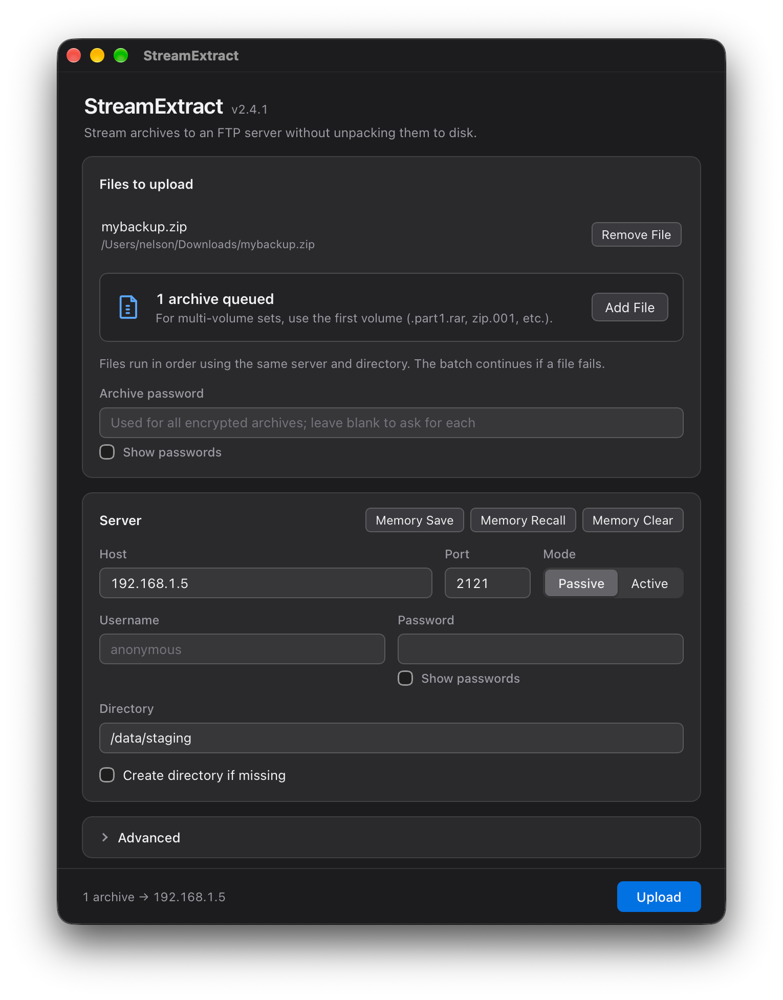
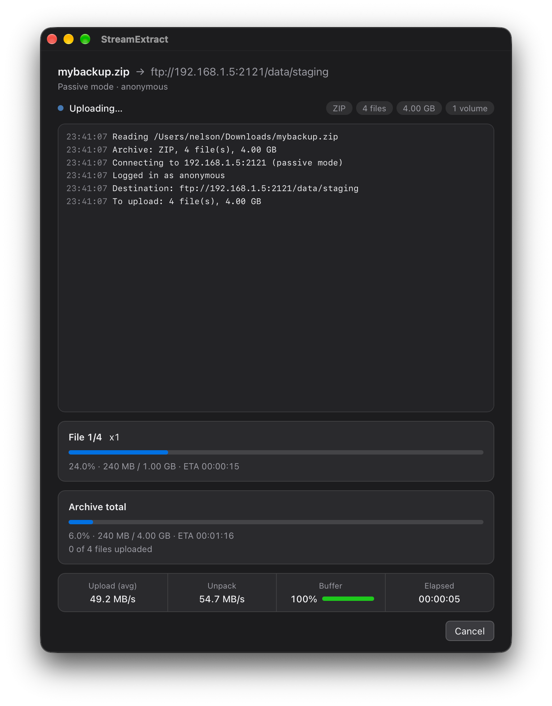

# rarftp

Uploads the contents of a RAR, ZIP, 7z or tar archive straight to an FTP
server, **without extracting it to disk first**.

The usual way to publish a huge archive is to extract it (needing as much free
space as the unpacked data, with the CPU busy and the network idle) and then
upload it (network busy, CPU idle). `rarftp` streams each file from the
decompressor to the FTP data connection instead:

- **No temporary files**: nothing is written to the local disk.
- **Decompression and upload overlap**: a bounded memory buffer (64 MiB by
  default) sits between the two, so the CPU and the network work at the same
  time.
- **No local name collisions**: since nothing is extracted locally, archives
  with names that differ only in letter case (`README.txt` / `Readme.txt`)
  upload correctly from case-insensitive systems (macOS, Windows) to
  case-sensitive servers.

It comes in two forms, with the same engine:

- [**rarftp-gui**](#desktop-app-rarftp-gui), a desktop app for Windows, macOS
  and Linux.
- [**rarftp**](#command-line-rarftp), a command-line tool with a full-screen
  terminal interface.

Both are published as assets of each release on the repository's
[**Releases** page](https://github.com/RuiNelson/rarftp/releases), one `.rar`
per platform. Extracting them needs a program that reads RAR5 (WinRAR, 7-Zip,
Keka, `unrar`, ...).

## Desktop app (rarftp-gui)

<table>
<tr>
<td></td>
<td></td>
</tr>
</table>

The app offers:

- **Archive**: drop a `.rar`, `.zip`, `.7z` or `.tar` (also `.tar.gz`, `.tgz`,
  `.tar.xz`...) on the window (the first volume, for multi-volume sets:
  `.part1.rar`, `.zip.001`, `.7z.001`) or pick it with a file dialog. When the archive is encrypted and no password was typed in, the
  app asks for it, and asks again if it was wrong.
- **Server**: host, port, passive or active mode, user and password (anonymous
  without a user), destination directory and *Create directory if missing*.
  *Advanced* has the buffer size and the verbose log.
- **Memory Save**, **Memory Recall** and **Memory Clear**: keep the server
  settings between runs in `~/.config/rarftp-gui/memory.ini` (under the home
  directory on every OS), a **plain text** file. The first time a login with a
  user name is saved, the app asks whether the user name and password may be
  stored unencrypted; if not, they are left out (Memory Clear also forgets the
  answer). The archive password is never stored.
- **Progress**: the current step, the current file and the whole archive with
  their ETAs, the upload and decompression speeds, the buffer fill, a live log,
  and a final summary with any warnings. **Cancel** stops the transfer and
  removes the incomplete remote file; closing the window during a transfer asks
  for confirmation first.

### Install the app

| Platform | Asset | Contents |
|---|---|---|
| Windows 10/11 (x64) | `rarftp-gui-windows-x64.rar` | `rarftp-gui.exe` and `rarftpcore.dll` |
| macOS 12+ (Intel and Apple Silicon) | `rarftp-gui-macos-universal.rar` | `rarftp-gui.app` |
| Linux (x64, glibc 2.35+) | `rarftp-gui-linux-x64.rar` | `rarftp-gui.AppImage` |
| Linux (arm64, glibc 2.35+) | `rarftp-gui-linux-arm64.rar` | `rarftp-gui.AppImage` |

Each archive also holds `LICENSE`, `README.md` and `THIRD_PARTY_NOTICES.md`.
The builds are portable: there is no installer.

- **Windows**: extract the archive into a folder of its own and run
  `rarftp-gui.exe`; keep `rarftpcore.dll` next to it. It uses the WebView2
  runtime that Windows 10 and 11 ship. The executable is not code-signed, so
  SmartScreen may warn the first time (*More info* → *Run anyway*).
- **macOS**: extract the archive and move `rarftp-gui.app` to `/Applications`.
  Release builds are signed with a Developer ID and notarized by Apple, so they
  open normally.
- **Linux**: extract the archive and run the AppImage (it needs FUSE 2, e.g.
  the `libfuse2` package):

  ```bash
  chmod +x rarftp-gui.AppImage
  ./rarftp-gui.AppImage
  ```

## Command line (rarftp)

```bash
rarftp --file archive.rar --host ftp.example.com --port 21 --mode passive \
       --user username --password "password" --directory "/destination/dir"
```

Multi-volume and password-protected archives are supported:

```bash
--archive-password "*[open sesame]*"
```

| Option | Description |
|---|---|
| `--file PATH` | RAR, ZIP, 7z or tar archive (plain or compressed), recognized by its content. For multi-volume sets, the first volume (`.part1.rar`, `.rar`, `.zip.001`, `.7z.001`, `.tar.001`). |
| `--host HOST` | FTP server name or address (IPv4 or IPv6). |
| `--port PORT` | Default `21`. |
| `--mode passive\|active` | Data connection mode. Default `passive`. |
| `--user NAME` | Without it, the login is anonymous. |
| `--password PASSWORD` | Requires `--user`. If omitted, it is asked for (hidden) on the terminal. |
| `--directory DIR` | Destination, absolute or relative to the login directory. Without it the login directory is used and a warning says which one. |
| `--mkdir` | Create the destination if it does not exist, with a single `MKD` (not recursive). Without it, a missing destination is an error. |
| `--archive-password PASSWORD` | For encrypted archives; asked for on the terminal when needed. `--rar-password`, its former name, still works. |
| `--no-tui` | Plain log output instead of the full-screen interface (automatic when not on a terminal). |
| `--verbose` | Log every FTP command and reply (the password is masked). |
| `--buffer MIB` | Memory buffer between decompression and upload. Default `64`. |

The interface shows a fixed log panel, the progress of the current file and of
the whole archive with their ETAs, the upload and decompression speeds, and
how full the buffer is (full: the network is the bottleneck; empty: the CPU
is). **Cancel** with `q`, `Esc` or `Ctrl-C` (or `SIGINT`/`SIGTERM` in plain
mode).

Exit codes: `0` success, `1` error, `2` invalid command line, `130` cancelled.

### Install the command line

| Platform | Asset |
|---|---|
| Windows (x64) | `rarftp-windows-x64.rar` |
| macOS (Intel and Apple Silicon) | `rarftp-macos-universal.rar` |
| Linux (x64, glibc 2.35+) | `rarftp-linux-x64.rar` |
| Linux (arm64, glibc 2.35+) | `rarftp-linux-arm64.rar` |

Each archive holds the `rarftp` executable, `LICENSE`, `README.md` and
`THIRD_PARTY_NOTICES.md`. The executables are statically linked and need no
other installation.

#### Windows

1. Extract `rarftp-windows-x64.rar` into `C:\rarftp`, so that the
   result is `C:\rarftp\rarftp.exe`.

2. Run it from a terminal:

   ```powershell
   C:\rarftp\rarftp.exe --version
   ```

The binary is not code-signed, so if it does not start at all, check whether
your antivirus quarantined it.

#### macOS

Release builds are signed with a Developer ID and notarized by Apple. Extract
the archive into a directory of its own and install it:

```bash
sudo install -d /usr/local/bin
sudo install -m 755 rarftp /usr/local/bin/rarftp
rarftp --version
```

#### Linux

```bash
unrar x rarftp-linux-x64.rar rarftp/        # or: 7z x -orarftp rarftp-linux-x64.rar
sudo install -m 755 rarftp/rarftp /usr/local/bin/rarftp
rarftp --version
```

Without root, install it into a directory in your `PATH` instead, for example
`install -D -m 755 rarftp/rarftp ~/.local/bin/rarftp`. The binary is built on
Ubuntu 22.04, so it runs on distributions with glibc 2.35 or newer; libstdc++
is linked statically.

## How it works

```
 extractor thread                         uploader thread
 UnRAR RAR_TEST / libarchive ──(1 MiB blocks)──▶ [ bounded buffer ] ──▶ libcurl STOR
 (checks CRC/BLAKE2, CRC-32)                                            (one control connection)
```

RAR archives are read with UnRAR's test mode, ZIP, 7z and tar archives with
libarchive: both decompress and verify every file in memory, without creating
it, and the decompressed data goes into the buffer, which the FTP upload drains.
A file only counts as uploaded after its checksum was confirmed (tar has none,
see below); on any error the incomplete remote file is deleted.

The command line links this engine statically. The app uses it through a
shared library (`librarftpcore`, C API in `src/capi/rarftp.h`).

Behaviour, in both:

- **Files already on the server** with the same size are skipped; with a
  different size they are overwritten. Re-running after a failure only sends
  what is missing or incomplete.
- **Directories** of the archive, including empty ones, are created.
- **Modification times** are preserved with `MFMT` (or vsftpd's `MDTM` form)
  when the server allows it.
- **RAR**: multi-volume, solid and encrypted (`-p`, `-hp`) archives, in every
  format UnRAR reads (RAR 5.x and older).
- **ZIP**: Stored, Deflate, BZip2, LZMA, XZ, Zstandard and PPMd entries, Zip64
  (files and archives over 4 GiB), traditional (ZipCrypto) and AES encryption, and
  archives split into numbered parts (`.zip.001`, `.zip.002`, ...). A wrong
  password is detected while reading the archive, before anything is sent. Names
  without the UTF-8 flag are read as UTF-8 when they are valid UTF-8 (macOS
  writes them like that), otherwise as code page 437 (on Windows: the system's
  OEM code page, as Windows itself does).
- **7z**: LZMA, LZMA2, BZip2, Deflate, PPMd and Zstandard with their filters
  (BCJ, BCJ2, ARM, ...), solid archives and archives split into numbered parts
  (`.7z.001`, ...).
- **tar**, every variant libarchive reads (POSIX, GNU, pax, old Unix ones),
  plain or compressed with gzip (`.tar.gz`, `.tgz`), bzip2 (`.tar.bz2`), xz
  (`.tar.xz`), lzma (`.tar.lzma`), Zstandard (`.tar.zst`) or LZ4 (`.tar.lz4`),
  also split into numbered parts (`.tar.001`, `.tar.gz.001`, ...). The format
  has **no checksum of the file contents**, only of its headers, so these files
  are uploaded without verification; a warning says so (gzip, xz, Zstandard and
  LZ4 check their own data, but over the whole stream or large blocks, not per
  file). Names without a pax header are read as UTF-8 when valid, otherwise as
  Latin-1 (on Windows: as UTF-8).
- **Compressed tar is read once, as it is uploaded.** Its files can only be
  reached by decompressing everything before them, so instead of listing the
  archive first, rarftp plans each file when it reaches it and checks the
  server just before sending it (a file already there with the same size is
  decompressed and dropped). There are no totals until the end: the progress
  and the ETA of the whole archive come from how much of the archive file has
  been read.
- The **format** is recognized by the content of the file, not by its extension.
- **Paths are sanitized** like UnRAR does: `..` components, absolute paths and
  control characters never escape the destination directory.
- **Fail-fast**: a checksum error, a missing volume or a network failure stops
  the transfer and removes the incomplete remote file.

### Not supported yet

FTPS, resuming or retrying a file after a network failure, extracting only
some files, and several parallel connections. Symbolic links, hard links and
file references (`rar -oi`) are skipped with a warning, since FTP cannot
create links.

Also not supported, with an explicit error: 7z archives with a password
(libarchive cannot decrypt them), ZIP entries compressed with Deflate64 (which
Windows Explorer uses for large files), old-style spanned ZIP archives (`.z01`,
`.z02`, ..., `.zip`) and single compressed files that are not tar archives
(a plain `.gz`).

## Building

Requirements: a C++17 compiler, CMake 3.21+, and libcurl (the system one is
used when present; otherwise, or with `-DRARFTP_BUNDLED_CURL=ON`, an FTP-only
libcurl is built from source). The other libraries are fetched by CMake.
libarchive and the compression libraries it uses (zlib, bzip2, liblzma, Zstandard,
LZ4 and, on Linux, mbed TLS) are built from source as static libraries during the
first build (`cmake/LibArchive.cmake`), which therefore takes a few minutes
longer.

The UnRAR sources are not part of this repository (they have their own
license) and must be extracted into `unrarsrc/`:

```bash
curl -LO https://www.rarlab.com/rar/unrarsrc-7.3.1.tar.gz
mkdir unrarsrc && tar -xzf unrarsrc-7.3.1.tar.gz -C unrarsrc --strip-components=1
```

### Command line

```bash
cmake -S . -B build -G Ninja -DCMAKE_BUILD_TYPE=Release
cmake --build build
```

The binary is `build/rarftp`. UnRAR and libarchive are always linked statically
into it.

### Desktop app

Besides the above, install Rust ([rustup](https://rustup.rs)) and the Tauri
CLI:

```bash
cargo install tauri-cli --version "^2" --locked
```

From the repository root, build the shared library, then the app:

```bash
cmake -S . -B build -G Ninja -DCMAKE_BUILD_TYPE=Release -DRARFTP_BUILD_LIBRARY=ON
cmake --build build

cd gui
cargo tauri build     # macOS: src-tauri/target/release/bundle/macos/rarftp-gui.app
cargo tauri dev       # or: run the app without bundling it
```

The library is `build/librarftpcore.dylib` (`.so` on Linux, `rarftpcore.dll` on
Windows). UnRAR, libarchive and {fmt} are linked statically into it, and it exports only the
`rarftp_*` functions of `src/capi/rarftp.h`; the `rarftp` executable does not use
it. Add `-DRARFTP_BUNDLED_CURL=ON` to link libcurl statically too, which makes
the library self-contained instead of relying on the system's libcurl.

On Linux `cargo tauri build` makes an AppImage; on Windows use
`cargo tauri build --no-bundle` and keep `rarftpcore.dll` next to
`src-tauri/target/release/rarftp-gui.exe` (the build copies it there). Linux
needs the WebKitGTK development packages that Tauri documents in its
[prerequisites](https://v2.tauri.app/start/prerequisites/#linux); on
Debian/Ubuntu, for example:

```bash
sudo apt install libwebkit2gtk-4.1-dev build-essential curl wget file libxdo-dev libssl-dev \
                 libayatana-appindicator3-dev librsvg2-dev
```

The Rust build looks for the library in `build/` (and `build/Release`); set
`RARFTP_LIB_DIR` to the directory that holds it to use another build directory.
The bundling settings (`gui/src-tauri/tauri.<os>.conf.json`) also name the
library under `../../build/`, so with another directory override that path too,
with the Tauri CLI's `--config` (a JSON merge into its configuration, handed to
the build script as well). On macOS:

```bash
RARFTP_LIB_DIR=/path/to/dir cargo tauri build \
    --config '{"bundle":{"macOS":{"frameworks":["/path/to/dir/librarftpcore.dylib"]}}}'
```

A macOS app built from source is signed ad hoc, not notarized, so Gatekeeper
blocks it once it has been copied to another Mac. Remove the quarantine
attribute there to open it:

```bash
xattr -dr com.apple.quarantine rarftp-gui.app
```

### Continuous integration

Developed and tested on macOS. The GitHub Actions workflow
(`.github/workflows/ci.yml`) builds and tests Linux (x64 and arm64), macOS
(universal) and Windows (x64), always with libcurl built from source and linked
statically (Windows does not ship it), and produces one `.rar` per platform,
for the command line and for the app. The macOS release assets are then signed
and notarized before they are published.

## Testing

Unit tests:

```bash
ctest --test-dir build --output-on-failure
```

End-to-end tests upload archives created with RARLAB's `rar`, Python's
`zipfile` and `tarfile`, 7-Zip and Info-ZIP's `zip` to vsftpd running in Docker
([delfer/alpine-ftp-server](https://hub.docker.com/r/delfer/alpine-ftp-server))
and compare what arrives, byte by byte. They need Docker, `rar` and Python 3.9+
(standard library only); the tests that need 7-Zip (`7zz`, found in `PATH` or
given with `--7z`) or `zip` are skipped without them:

```bash
python3 tests/integration/run.py --rarftp build/rarftp --rar /path/to/rar --7z /path/to/7zz
```

`--big` adds a 4.5 GiB file. Active mode is only tested on Linux, where the
container address is reachable directly; Docker Desktop only publishes ports.

With the library built (`-DRARFTP_BUILD_LIBRARY=ON`), `ctest` also runs a
smoke test of its C API, and `--lib` adds tests that drive the library the way
the app does (through its C API, with `ctypes`): uploads, re-runs, multi-volume
and encrypted archives, the password prompt, errors and cancelling. They are
named `lib_*`:

```bash
python3 tests/integration/run.py --rarftp build/rarftp --rar /path/to/rar \
        --lib build/librarftpcore.dylib -k lib_
```

The Rust side has its own unit tests, which link the built library:
`cargo test --manifest-path gui/src-tauri/Cargo.toml`.

## Libraries

| Library | Use | License |
|---|---|---|
| [UnRAR](https://www.rarlab.com/rar_add.htm) | RAR decompression | UnRAR license (freeware) |
| [libarchive](https://www.libarchive.org) | ZIP, 7z and tar reading | BSD-2-Clause |
| [zlib](https://zlib.net), [bzip2](https://sourceware.org/bzip2/), [liblzma](https://tukaani.org/xz/), [Zstandard](https://facebook.github.io/zstd/), [LZ4](https://lz4.org) | Decompression for libarchive | zlib, bzip2 (BSD-like), 0BSD, BSD-3-Clause, BSD-2-Clause |
| [mbed TLS](https://www.trustedfirmware.org/projects/mbed-tls/) | AES for encrypted ZIP files (Linux only; macOS and Windows use the system's) | Apache-2.0 |
| [libcurl](https://curl.se/libcurl/) | FTP client | curl (MIT/X derivative) |
| [FTXUI](https://github.com/ArthurSonzogni/FTXUI) | Terminal interface (command line only) | MIT |
| [CLI11](https://github.com/CLIUtils/CLI11) | Command line parsing (command line only) | BSD-3-Clause |
| [{fmt}](https://github.com/fmtlib/fmt) | Formatting | MIT |
| [doctest](https://github.com/doctest/doctest) | Unit tests | MIT |
| [Tauri](https://tauri.app) | Desktop app (app only), with its Rust dependencies | MIT or Apache-2.0 |

## License

This project is licensed under the MIT license (see `LICENSE`). Binaries also
contain UnRAR, whose license allows free use in any software handling RAR
archives but forbids using its code to re-create the RAR compression
algorithm, and libarchive with the libraries above; see
`THIRD_PARTY_NOTICES.md`, which also covers what only the app contains (Tauri
and its Rust dependencies).
